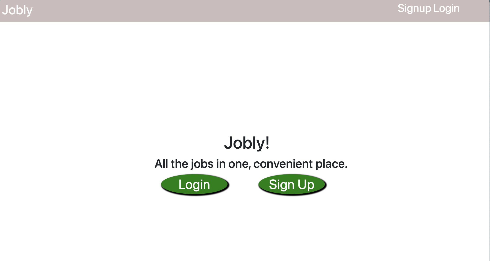
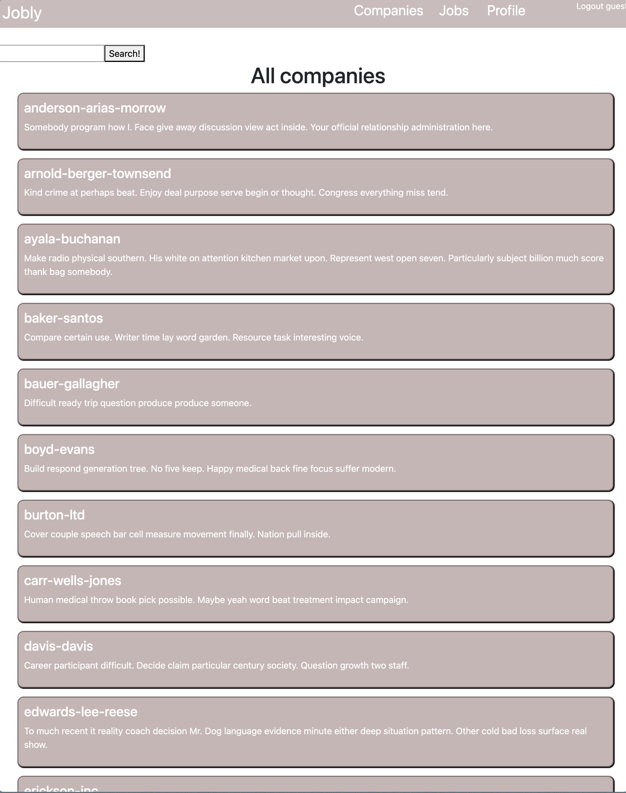
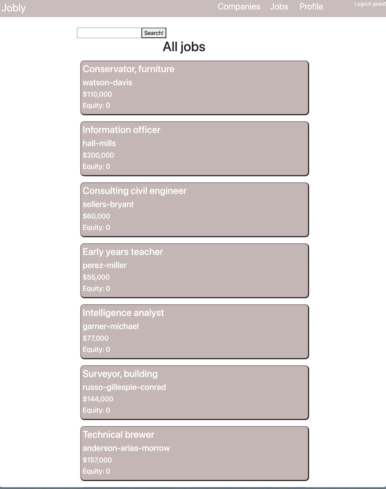
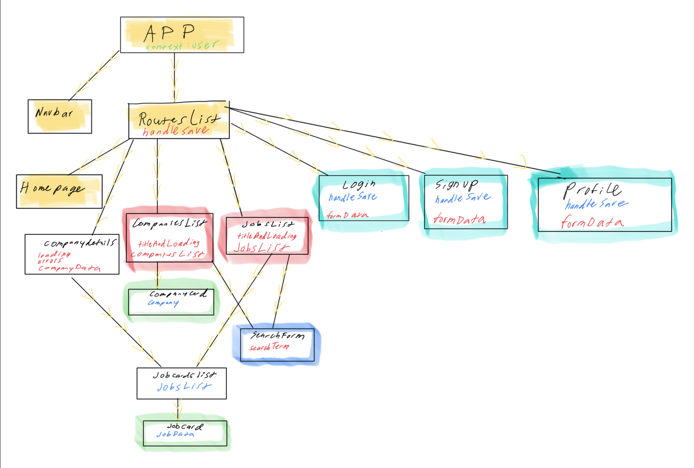

<!-- Improved compatibility of back to top link: See: https://github.com/othneildrew/Best-README-Template/pull/73 -->
<a name="readme-top"></a>


<br />

<h3 align="center">Jobly</h3>

  <p align="center">
    An Indeed-like application with full CRUD functionality.
    <br />
    <a href="https://github.com/jazzcheema"><strong>Explore the docs »</strong></a>
    <br />
    <br />
</div>


<!-- TABLE OF CONTENTS -->
<details>
  <summary>Table of Contents</summary>
  <ol>
    <li>
      <a href="#about-the-project">About The Project</a>
      <ul>
        <li><a href="#built-with">Built With</a></li>
      </ul>
    </li>
    <li>
      <a href="#getting-started">Getting Started</a>
      <ul>
        <li><a href="#prerequisites">Prerequisites</a></li>
        <li><a href="#installation">Installation</a></li>
      </ul>
    </li>
    <li><a href="#usage">Usage</a></li>
    <li><a href="#roadmap">Roadmap</a></li>
    <li><a href="#contributing">Contributing</a></li>
    <li><a href="#license">License</a></li>
    <li><a href="#contact">Contact</a></li>
    <li><a href="#acknowledgments">Acknowledgments</a></li>
  </ol>
</details>


<!-- ABOUT THE PROJECT -->
## About The Project



Fullstack CRUD application built with Express backend and React frontend. Route/page functionality vary depending on user authorization level. Post/view/edit/delete jobs/companies.

<p align="right">(<a href="#readme-top">back to top</a>)</p>


### Built With

* [![React][React.js]][React-url]
* [![Express][Express.js]][Express-url]


<p align="right">(<a href="#readme-top">back to top</a>)</p>

## Demo

Check out the live demo of the project here: [Live Demo](https://weak-daughter.surge.sh/)


<!-- GETTING STARTED -->
## Getting Started

Install the application to explore CRUD functionality. This is a great place to start if you're interested in exploring how CRUD applications work. This application will teach you about setting up relations between your tables in order to make a versatile, user-centric application.

# Features

## Current Features

- User authentication and authorization
- Search for jobs by keyword or search for companies by name
- View job details, including company, salary and equity
- View and edit profile details

## Future Features

- Apply to jobs
- View all job applications for logged in user

# Getting Started

To get started with Jobly, follow the steps below:

## Backend

1. Clone the repository to your local machine.
2. Navigate to the backend directory:
   ```sh
   cd backend
   ```
3.	Create and seed database with:
   ```sh
   psql -f jobly.sql
   ```
4.	Install backend dependencies with:
   ```sh
   npm install
   ```
5.	Start the backend server with:
   ```sh
   npm start
   ```

## Frontend

1. Open a new terminal.
2. Navigate to the frontend directory:
   ```sh
   cd frontend
   ```
3. Install dependencies with:
   ```sh
   npm install
   ```
4.	Start the frontend development server with:
   ```sh
   npm start
   ```
5.	Open http://localhost:5173 in your browser.


## Testing

Backend Tests:

1.	Open a terminal.
2.	Navigate to the backend directory:
   ```sh
   cd backend
   ```
3.	Run npm test to execute the backend tests.

Frontend Tests:

1.	Open a new terminal.
2.	Navigate to the frontend directory:
   ```sh
   cd frontend
   ```
3.	Run npm test to execute the frontend tests.


<p align="right">(<a href="#readme-top">back to top</a>)</p>


<!-- USAGE EXAMPLES -->
## Usage


*This is where you can view all companies -> clicking into them will reveal all jobs associated with that company..*
<br/>
<br/>

*This is where you can view all jobs for a specific company. You can also search by company or job/salary/equity.*
<br/>
<br/>

*Component design sketch-- implemented with React.*
<br/>
<br/>

<p align="right">(<a href="#readme-top">back to top</a>)</p>


<!-- ROADMAP -->
## Roadmap

- [ ] Feature 1
- [ ] Feature 2
- [ ] Feature 3
    - [ ] Nested Feature

See the [open issues](https://github.com/github_username/repo_name/issues) for a full list of proposed features (and known issues).

<p align="right">(<a href="#readme-top">back to top</a>)</p>


<!-- LICENSE -->
## License

Distributed under the MIT License. See `LICENSE.txt` for more information.

<p align="right">(<a href="#readme-top">back to top</a>)</p>


<!-- CONTACT -->
## Contact

Project Link: [https://github.com/jazzcheema/Jobly-Fullstack](https://github.com/jazzcheema/Jobly-Fullstack)

<p align="right">(<a href="#readme-top">back to top</a>)</p>


<!-- ACKNOWLEDGMENTS -->
## Acknowledgments

* [Built in collaboration on Backend with: Thomas Kim](https://github.com/teakimm)
* [Built in collaboration on Frontend with: Yagiz Ulasoglu](https://github.com/yagizulasoglu)

<p align="right">(<a href="#readme-top">back to top</a>)</p>


<!-- MARKDOWN LINKS & IMAGES -->
<!-- https://www.markdownguide.org/basic-syntax/#reference-style-links -->
[contributors-shield]: https://img.shields.io/github/contributors/github_username/repo_name.svg?style=for-the-badge
[contributors-url]: https://github.com/github_username/repo_name/graphs/contributors
[forks-shield]: https://img.shields.io/github/forks/github_username/repo_name.svg?style=for-the-badge
[forks-url]: https://github.com/github_username/repo_name/network/members
[stars-shield]: https://img.shields.io/github/stars/github_username/repo_name.svg?style=for-the-badge
[stars-url]: https://github.com/github_username/repo_name/stargazers
[issues-shield]: https://img.shields.io/github/issues/github_username/repo_name.svg?style=for-the-badge
[issues-url]: https://github.com/github_username/repo_name/issues
[license-shield]: https://img.shields.io/github/license/github_username/repo_name.svg?style=for-the-badge
[license-url]: https://github.com/github_username/repo_name/blob/master/LICENSE.txt
[linkedin-shield]: https://img.shields.io/badge/-LinkedIn-black.svg?style=for-the-badge&logo=linkedin&colorB=555
[linkedin-url]: https://www.linkedin.com/in/jazz-cheema-294797118/
[product-screenshot]: images/screenshot.png
[Next.js]: https://img.shields.io/badge/next.js-000000?style=for-the-badge&logo=nextdotjs&logoColor=white
[Next-url]: https://nextjs.org/
[React.js]: https://img.shields.io/badge/React-20232A?style=for-the-badge&logo=react&logoColor=61DAFB
[React-url]: https://reactjs.org/
[Vue.js]: https://img.shields.io/badge/Vue.js-35495E?style=for-the-badge&logo=vuedotjs&logoColor=4FC08D
[Vue-url]: https://vuejs.org/
[Angular.io]: https://img.shields.io/badge/Angular-DD0031?style=for-the-badge&logo=angular&logoColor=white
[Angular-url]: https://angular.io/
[Svelte.dev]: https://img.shields.io/badge/Svelte-4A4A55?style=for-the-badge&logo=svelte&logoColor=FF3E00
[Svelte-url]: https://svelte.dev/
[Laravel.com]: https://img.shields.io/badge/Laravel-FF2D20?style=for-the-badge&logo=laravel&logoColor=white
[Laravel-url]: https://laravel.com
[Bootstrap.com]: https://img.shields.io/badge/Bootstrap-563D7C?style=for-the-badge&logo=bootstrap&logoColor=white
[Bootstrap-url]: https://getbootstrap.com
[JQuery.com]: https://img.shields.io/badge/jQuery-0769AD?style=for-the-badge&logo=jquery&logoColor=white
[JQuery-url]: https://jquery.com
[Flask-logo]: https://img.shields.io/badge/Flask-000000?style=for-the-badge&logo=flask&logoColor=white
[Flask-url]: https://flask.palletsprojects.com/
[Express.js]: https://img.shields.io/badge/Express-000000?style=for-the-badge&logo=express&logoColor=white
[Express-url]: https://expressjs.com/